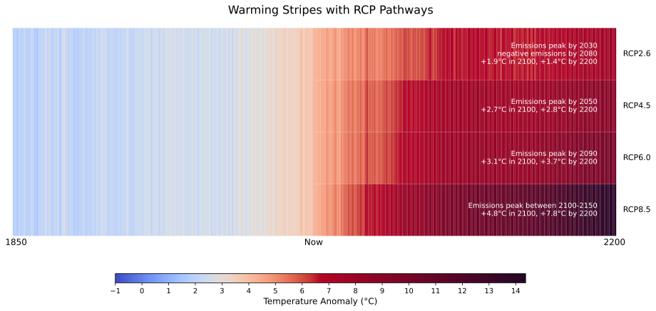

# warningstripes
This is a Python script that builds recent RCP pathway warning stripes using data from Berkeley Earth. Inspired by the work of Alexander Radtke (https://x.com/alxrdk), see https://rateofchange.substack.com/p/the-rate-of-change.

The images created by the script are looking as follows:

Feel free to modify it. Unfortunately, I was unable to achieve the same scissor split as he did in the graphics.

# A few words on the generation process
It automatically downloads the data on land-surface average results produced by the Berkeley Averaging method from https://berkeleyearth.org/data/. 
Then it takes the last year values until 1848, scales them up by the offset difference of the 2024 to 1848 result and then puts a linear interpolation over these new values matching the RCP scenarios.
Here, it is assumed that following 
- RCP 2.6, we hit +1.9°C by 2100 and +1.4°C by 2200
- RCP 4.5, we hit +2.87°C by 2100 and +2.8°C by 2200
- RCP 6.0, we hit +3.1°C by 2100 and +3.7°C by 2200
- RCP 8.5, we hit +4.8°C by 2100 and +7.8°C by 220.
